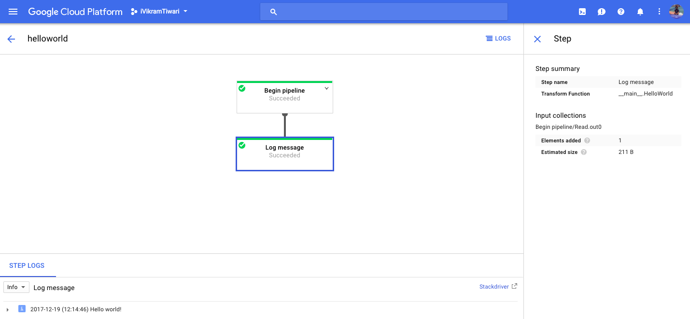

# Dataflow/Apache Beam Python Samples

## Requirements
- An active Google Cloud project
- Dataflow API activated
- python 2.7

## Setup
Using python 2.7, pip and virtualenv

``` bash
# clone the project
git clone https://github.com/VikramTiwari/dataflow-samples.git dataflow-samples 
# switch to the directory
cd dataflow-sample 
# make sure it's 2.7
python --version 
# this will create a virtual environment without affecting anything on your system
virtualenv dataflow 
# activate virual environment
source dataflow/bin/activate 
# install necessary packages
pip install --upgrade setuptools apache-beam
pip install --upgrade apache-beam[gcp]
```

## Samples

### To run samples, follow the instructions at the top of each file

- [Hello World](./hello_world.py)
- [Export BigQuery table to Google Storage](./export_bigquery_table_to_google_storage.py)

## Google Cloud - Dataflow Console
